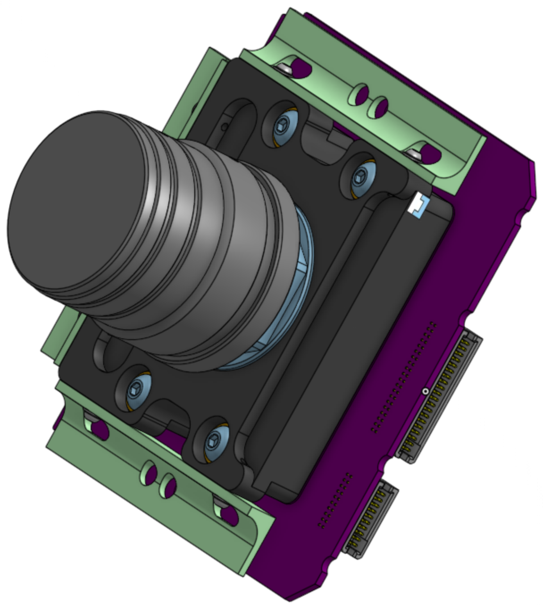
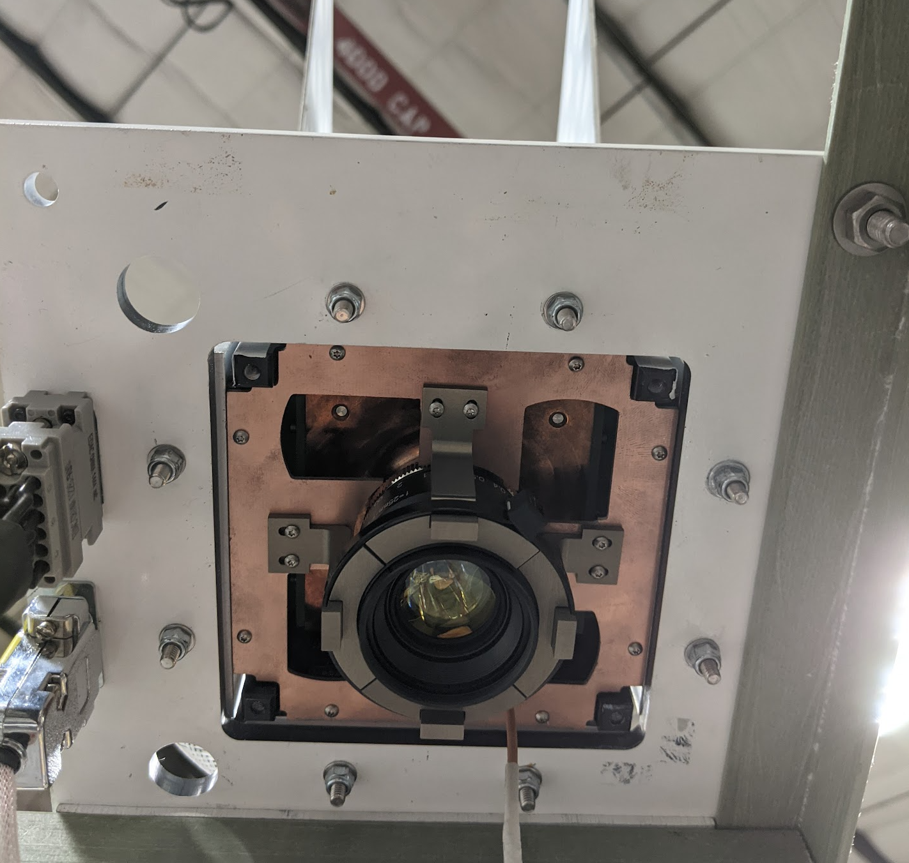
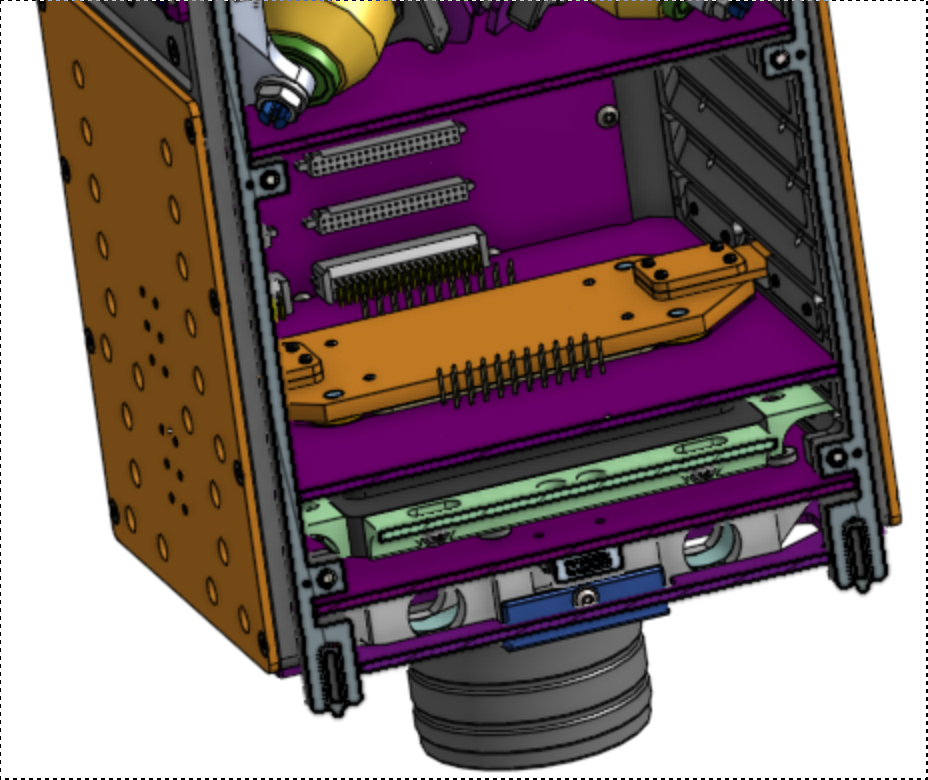

# oresat-cfc-hardware

Cirrrus Flux Camera hardware repository. See also https://www.oresat.org/satellites/oresat/mission-2-cfc.

## General information
The Cirrus Flux Camera (CFC) is a Short Wave Infrared (SWIR) camera meant to map the global distribution of high-altitude cirrus clouds. It works by looking at the reflected sunlight from clouds in three SWIR bands. The primary investigators (PIs) for CFC calibration, data processing, and climate science are our collaborators at the [University of Maryland Baltimore Count (UMBC)'s Earth and Space Institute (ESI)](https://esi.umbc.edu/) as well as by our collaborators at the [University College London (UCL) Mullard Space Science Laboratory (MSSL)](https://www.ucl.ac.uk/mathematical-physical-sciences/mssl).

Older versions of the CFC flew on the [2022 NASA High Altitude Student Payload (HASP)](https://sg-webserver.phys.lsu.edu/) mission.

Different but modern versions were flown by [UMBC's AirHARP mission](https://esi.umbc.edu/airharp2-at-pace-pax/) on the NASA ER-2 high altitude plane.

Most recently, we flew a preliminary technology demonstration mission on [OreSat0.5](https://www.oresat.org/satellites/oresat0-5) launched August 16th, 2024.

We're planning on flying the science mission camera on OreSat1 in Q2 2026.

Versions of the CFC have also flown on the NASA High Altitude Student Payload (HASP) in New Mexico, and 
## Technical information about the CFC sensor

- Princeton IR PIRT1280 InGaAs focal plane array (1280 x 1024 with 12 um pixels), sensitive to roughly 800 - 1600 nm.
- We cool the sensor to -8 deg C using its built-in thermal electric cooler (TEC - just a standard Peltier device).
- We use three filters on the PIRT1280 sensors:
   - 870 nm: [Torrent Photonics Optical Filter Shop 2020OFS-870](https://opticalfiltershop.com/shop/bandpass-filter/nir-bandpass-700nm-to-1100nm/nir-bandpass-filter-870nm-fwhm-30nm/)
   - 1390 nm: [Torrent Photonics Optical Filter Shop 2020OFS-1390](https://opticalfiltershop.com/shop/bandpass-filter/swir-bandpass-filters-1-1um-to-3-0um/swir-bandpass-filter-1390nm-fwhm-35nm/)
   - 1590 nm: [Torrent Photonics Optical Filter Shop 2020OFS-1590](https://opticalfiltershop.com/shop/bandpass-filter/swir-bandpass-filters-1-1um-to-3-0um/swir-bandpass-filter-1590nm-fwhm-40nm/)
- Lens is the [Navitar SWIR-35](https://store.navitar.com/swir-35-35-mm/), a 35 mm  SWIR lens with focus adjustable apateur. 

## Technical information on the system

- The **CFC Sensor Card** is a PCB in backplane slot 18. It has:
   - The PIRT 1280 sensor soldered on the PCB
   - A custom machined lens adapter between the card and the lens.
   - Custom machined G10 L brackets between the custom machined lens adapter and slot 19 
   - The lens on the adapter sticks through the -Z end card, through the -Z end cap, and finally out into the tuna can volume. A 3D printed adapter on the End Card holds the monopole deployers and holds the camera lens at the End Card and End Cap levels.
   - The SWIR lens sticks into the tuna-can space on the -Z end of OreSat0.5 and OreSat1.
- The **CFC Processor Card** is a PCB in backplane slot 17 with:
   - LVDS to PRU adapter IC
   - an [Octavo OSD335x-SM](https://octavosystems.com/octavo_products/osd335x-sm/) system in package (SIP) processor with 1 GB DRAM and a 16 GB eMMC storage IC.
 
## Design Notes

- Mostly on our Google Drive right now, here's the beginnings of our [CFC Design Notes](https://docs.google.com/document/d/1nDrTuUim9k1om3DOcBtnp3ixVvrmmALAsb2CZlDwwio/edit?usp=sharing).

## Links to CAD

- [OreSat CFC Camera mechnical in OnShape](https://cad.onshape.com/documents/0e986a82427039a7549eafca/v/f54f3484c685a75ab5bd82ce/e/deddd282159689e0e52f600b)
- [OreSat0.5 containing the CFC assembly in OnShape](https://cad.onshape.com/documents/c0a6cf3367d8fdcad3a3c2e1/w/ca55e3ec6f041493d70e4b39/e/591851cdc8c634aae1522f90)
- [Electronics CAD on Github](https://github.com/oresat/oresat-cfc-hardware) - mostly KiCad with some older EAGLE files.
- [Kernel module](https://github.com/oresat/oresat-prucam-pirt1280) for the PIRT 1280 on the Octavo's PRU.

## License

All materials in this repo are copyright Portland State Aerospace Society and are licensed under the CERN Open Hardware Licence Version 2 -
Strongly Reciprocal (CERN-OHL-S v2), or any later version. A copy of the license is located in [here](LICENSE.md).

